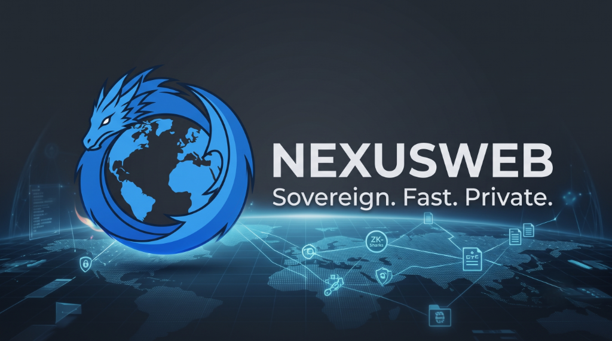
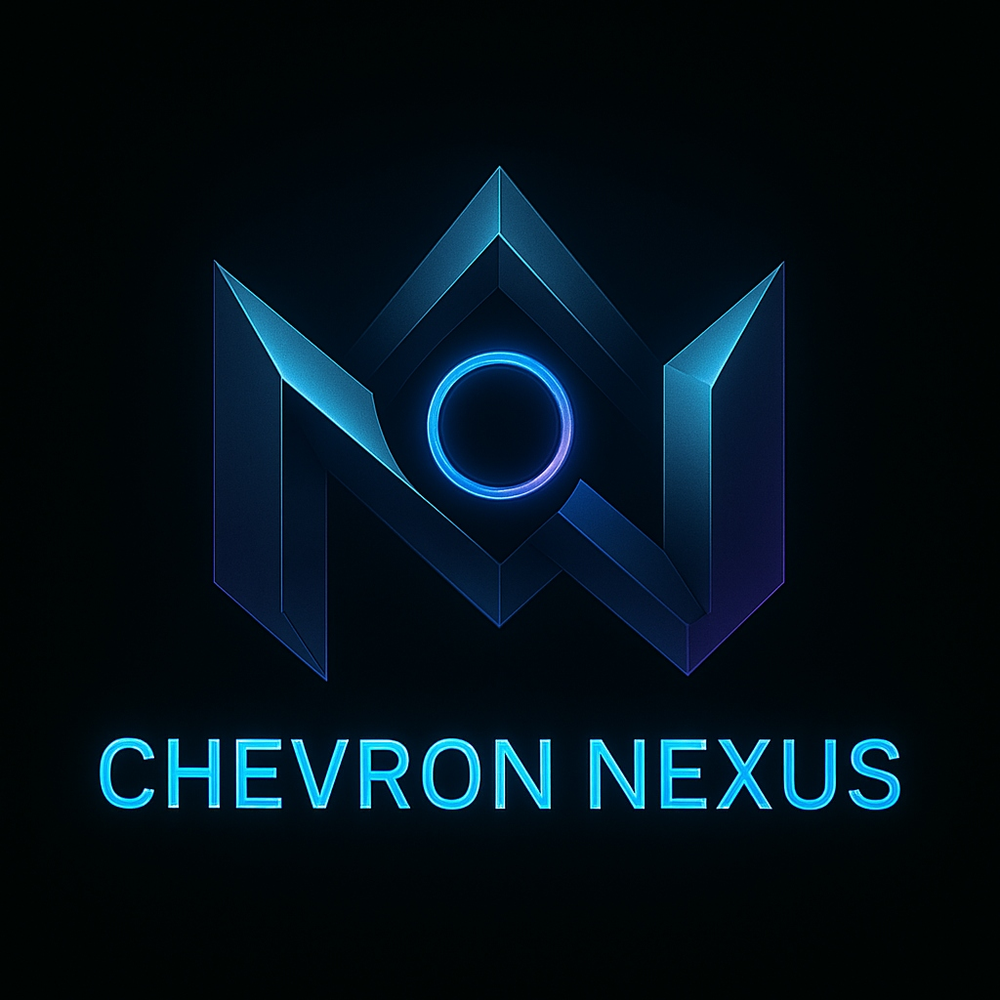

<div align="center">



<br/>

# 🌐 NeXusWeb Browser (V10.0.0)
### **Sovereign Privacy-First Web Infrastructure & Developer Browser**
*Crafted with precision by **Chevron Nexus Software Private Limited** — [www.ChevronNexus.com](https://www.ChevronNexus.com)*

<br/>

[](https://github.com/ChevronNexus/NeXusWeb)
[](https://github.com/ChevronNexus/NeXusWeb)
[](LICENSE)
[-blueviolet.svg?style=for-the-badge)](#-core-architectural-philosophy)

<p align="center">
  <b>NeXusWeb</b> is a next-generation sovereign web browser engineered specifically for developers, power users, and privacy purists.<br/>
  Featuring <b>zero corporate telemetry</b>, <b>local-first data sovereignty</b>, <b>zero-knowledge E2EE sync</b>, <b>native developer workbenches</b>, and <b>Cloudflare Turnstile / Chrome parity</b>.
</p>

[**Website**](https://www.ChevronNexus.com) • [**Download Setup**](#-quick-start--installation) • [**Documentation**](#-flagship-v1000-feature-highlights) • [**Prototypes Matrix**](#-complete-prototype-evolution-matrix-v1-to-v10) • [**Privacy Policy**](prototype%20V10/Privacy%20Policy.txt) • [**Terms**](prototype%20V10/Terms&Conditions.txt)

</div>

---

## 📑 Table of Contents
- [🏛️ Core Architectural Philosophy](#️-core-architectural-philosophy)
- [📜 Complete Prototype Evolution Matrix (V1 to V10)](#-complete-prototype-evolution-matrix-v1-to-v10)
- [🚀 Flagship V10.0.0 Feature Highlights](#-flagship-v1000-feature-highlights)
  - [📁 Universal In-Browser File Viewer (Zero Cloud Uploads)](#-universal-in-browser-file-viewer-zero-cloud-uploads)
  - [🛡️ Cloudflare Turnstile & Chrome Parity Engine](#️-cloudflare-turnstile--chrome-parity-engine)
  - [🏠 ChevronNexus Home (Pro) Local Network Server](#-chevronnexus-home-pro-local-network-server)
  - [🛑 Built-in Ad-Shield & YouTube Fast-Forwarder](#-built-in-ad-shield--youtube-fast-forwarder)
  - [🔐 Encrypted Password & AutoFill Studio](#-encrypted-password--autofill-studio)
  - [📺 Multi-Device Media Casting (Chromecast / AirPlay / DLNA)](#-multi-device-media-casting-chromecast--airplay--dlna)
- [🔄 ChevronNexus Sync 1.2.0 Engine](#-chevronnexus-sync-120-engine)
- [🛠️ Integrated Developer Workbenches](#️-integrated-developer-workbenches)
- [📂 Repository Architecture](#-repository-architecture)
- [💻 Quick Start & Installation](#-quick-start--installation)
- [⌨️ Global Keyboard Shortcuts Reference](#️-global-keyboard-shortcuts-reference)
- [📊 Feature Comparison Matrix](#-feature-comparison-matrix)
- [⚖️ Privacy, Security & Legal Compliance](#-privacy-security--legal-compliance)
- [🏢 About Chevron Nexus Software](#-about-chevron-nexus-software)

---

## 🏛️ Core Architectural Philosophy

NeXusWeb is built from the ground up on the principle of **Absolute Digital Sovereignty**:

> [!IMPORTANT]
> **Zero Telemetry Guarantee:** NeXusWeb contains **ZERO** tracking beacons, covert profiling scripts, or involuntary telemetry dispatchers. Your browsing history, keystrokes, bookmarks, passwords, and search queries remain exclusively on **YOUR** local device.

* **🔒 Local-First Data Residency:** All databases (history, credentials, bookmarks, scratchpads) reside locally inside your operating system's application directory.
* **🛡️ Client-Side Zero-Knowledge Cryptography:** Multi-device synchronization uses client-side **AES-256-GCM** encryption with **PBKDF2** (600,000 iterations). Decryption keys never leave your machine.
* **⚡ Native Chromium Parity:** Pure `--disable-blink-features=AutomationControlled` Blink flags and authentic `Sec-CH-UA` Client Hints to pass Cloudflare Turnstile and Google Sign-In with zero false positives.

---

## 📜 Complete Prototype Evolution Matrix (V1 to V10)

Across the repository history, NeXusWeb evolved across **10 major prototype generations** spanning **17 distinct milestone releases**:

| Prototype | Directory | Version | Major Features & Architectural Milestones |
| :--- | :--- | :--- | :--- |
| **Prototype V1** | [`prototype V1/`](prototype%20V1) | `v1.0.0` | **The Genesis:** 3-Mode Network Architecture (*Strict Offline*, *Local Network*, *Developer Mode*), embedded PTY Terminal (`@xterm/xterm` + `node-pty`), active localhost port scanner. |
| **Prototype V2** | [`prototype V2/`](prototype%20V2) | `v2.0.0` | **Developer Workspace:** ScratchPad markdown notes, Media Panel & HUD, basic side-by-side split view, download progress manager, find bar (`Ctrl+F`). |
| **Prototype V3** | [`prototype V3/`](prototype%20V3) | `v3.0.0` | **Network Intelligence:** Command Palette (`Ctrl+K`), live Request Inspector (HTTP logger), `.env` file reader/injector, Reader Mode, persistent Bookmarks bar. |
| **Prototype V4** | [`prototype V4/`](prototype%20V4) | `v4.0.0` | **API Workbenches:** REST/GraphQL API Workbench, Chrome Extension Loader (MV2/MV3), Theme Customizer, Resource Monitor, zero-CORS dev mode. |
| **Prototype V5** | [`prototype V5/`](prototype%20V5) | `v5.0.0` | **Glassmorphic UI & Sandbox:** Private Den Sandbox (`partition: memory`), QuickTools slide-out drawer, custom glassmorphic context menu, synchronized live viewport resizing. |
| **Stable V6.5** | [`Stable V6.5.0/`](Stable%20V6.5.0) | `v6.5.0` | **Installer & Split Resizer:** Dynamic proportional split divider (`10%` to `90%`), automated C# WPF setup builder (`SetupInstaller.cs`), delta updater system. |
| **Prototype V7** | [`prototype V7/`](prototype%20V7) | `v7.0.0`<br>`v7.1.0`<br>`v7.5.0` | **VPN & Safari Media Engine:** Native Encrypted DNS/VPN Tunnel (`vpnEngine.js`), DNS-over-HTTPS (DoH via Cloudflare/Quad9), multi-region routing (US, NL, SG, UK, DE), Safari-style video player with speed chips & PiP, True HTML5 Fullscreen (0px offset). |
| **Prototype V8** | [`prototype V8/`](prototype%20V8)<br>[`PrototypeV8.1.0/`](PrototypeV8.1.0) | `v8.1.0`<br>`v8.5.0` | **DevStudio & Performance:** AES-256-GCM Password & AutoFill Studio, YouTube Ad Fast-Forwarder (<50ms auto-skip at 16x speed), Browser Task Manager, Media Casting (Chromecast/AirPlay/DLNA), standalone PWA WebApps, Memory Saver tab suspender, Android APK touch UI. |
| **Prototype V9** | [`prototype V9/`](prototype%20V9) | `v9.0.1`<br>`v9.1.0`<br>`v9.5.0`<br>`v9.5.1`<br>`v9.6.0` | **Sovereign Sync 1.2.0:** Chromium `/command` Protocol Dispatcher (Dual Protobuf/JSON), 64-bit monotonic sequence counters, real-time WebSocket push broker, BIP39 12-word recovery seed, 2FA TOTP, Google Sign-in hardening, multi-platform packaging (Windows/Linux/Android). |
| **Prototype V10** | [`prototype V10/V10.0.0/`](prototype%20V10/V10.0.0) | `v10.0.0` | **Flagship Universal Infrastructure:** In-browser Universal File Viewer (PDF, DOCX, XLSX, HEIC, ZIP), Cloudflare Turnstile & Chrome Parity Engine, ChevronNexus Home (Pro) Server, Download Target Controller, complete legal compliance suite. |

---

## 🚀 Flagship V10.0.0 Feature Highlights

### 📁 Universal In-Browser File Viewer (Zero Cloud Uploads)
Open, inspect, and render local or downloaded documents directly inside NeXusWeb with **zero third-party cloud uploads**:
* **Office Documents:** Word (`.docx` via `mammoth`), Excel spreadsheets (`.xlsx`), Markdown (`.md`), Plaintext (`.txt`, `.json`, `.csv`, `.log`, `.env`).
* **High-Res PDF Viewer:** Built-in PDF reader with search, page jump, and zoom controls.
* **Modern Media & Photos:** High-Efficiency Image Container (`.heic` via `heic2any`), WebP, SVG, PNG, JPEG, GIF.
* **Compressed Archives:** Inspect and unpack `.zip` archives directly in-browser using `adm-zip`.
* **Audio & Video:** Native HTML5 streaming for MP4, WebM, MP3, WAV, OGG, FLAC.

### 🛡️ Cloudflare Turnstile & Chrome Parity Engine
* **Clean Prototype Chain:** Utilizes native `--disable-blink-features=AutomationControlled` switch to keep `Navigator.prototype` authentic without stealth script injection.
* **Authentic Client Hints:** Delivers `Sec-CH-UA`, `Sec-CH-UA-Platform`, and `Sec-CH-UA-Mobile` headers matching vanilla Google Chrome.
* **Challenge Referer Preservation:** Preserves cross-origin referer tokens on `challenges.cloudflare.com` and `recaptcha.net` frames, ensuring Turnstile verification passes seamlessly on sites like Cinevo.

### 🏠 ChevronNexus Home (Pro) Local Network Server
* Transforms your desktop into a high-speed private home server operating strictly on your local WiFi/Ethernet subnet (`127.0.0.1`, `192.168.x.x`).
* **Intranet Media Streaming & Transcoding:** Stream personal videos and music to household devices with zero cloud bandwidth usage.
* **WiFi Monitor & Discovery:** Automatic UDP port `45454` broadcast discovery for instant device pairing and remote tab pushing.

### 🛑 Built-in Ad-Shield & YouTube Fast-Forwarder
* **High-Performance Network Filter:** Local blocklist filtering 250+ known tracking, telemetry, cryptomining, and advertisement domains.
* **YouTube Video Ad Fast-Forwarder:** Accelerates video ads to 16x speed + mute, auto-skipping ads in `< 50ms` without black screen freezes.
* **Anti-Adblock Defuser:** Automatically detects and defuses "Ad blockers violate YouTube Terms of Service" popups.

### 🔐 Encrypted Password & AutoFill Studio
* Encrypted local credentials vault utilizing **AES-256-GCM** with **PBKDF2** key stretching (600,000 rounds).
* High-entropy password generator with entropy scoring, security audit engine, in-page autofill injector, and Chrome/Bitwarden CSV/JSON import/export.

### 📺 Multi-Device Media Casting (Chromecast / AirPlay / DLNA)
* Automatic mDNS/SSDP discovery to cast browser tabs, video streams, or the entire desktop to **Google Chromecast**, **Apple AirPlay**, and **DLNA Smart TVs**.

### ⚡ Memory Saver & Browser Task Manager
* **Inactive Tab Suspender:** Discards memory from background tabs after a configurable inactivity timeout, reducing RAM usage by up to 80%.
* **Process Task Manager (`Shift+Esc`):** Real-time monitoring of Main, GPU, Tab, Extension, and Daemon processes with 1-click process termination.

---

## 🔄 ChevronNexus Sync 1.2.0 Engine

NeXusWeb includes a sovereign, self-hostable, zero-knowledge sync engine:
* **Zero-Knowledge Architecture:** Encrypted on the client device using AES-256-GCM before transmission; the sync server only stores opaque ciphertext.
* **Chromium `/command` Protocol Dispatcher:** Supports binary Protocol Buffers (`application/x-protobuf`) and JSON envelopes (`application/json`).
* **64-bit Monotonic Sequence Counters:** Strictly ordered sequence counters eliminate clock drift and timestamp skew across devices.
* **Sub-50ms WebSocket Push Broker:** Instant push notifications trigger immediate multi-device tab forwarding and delta syncing.
* **12-Word BIP39 Seed Phrase:** Cold storage emergency recovery seed + RFC 6238 TOTP two-factor authentication.

---

## 🛠️ Integrated Developer Workbenches

```text
┌────────────────────────────────────────────────────────────────────────┐
│                        NeXusWeb DevSuite                               │
├───────────────────┬───────────────────┬────────────────────────────────┤
│ ⚡ API Workbench  │ 🔌 Port Manager   │ 🔍 Request Inspector           │
│ REST & GraphQL    │ Detects 3000/5173 │ Real-time HTTP/HTTPS logger    │
│ Headers & JSON    │ 1-Click PID Kill  │ Status, Timings, & Headers     │
├───────────────────┼───────────────────┼────────────────────────────────┤
│ 📝 ScratchPad     │ 💻 Dev Terminal   │ 🧩 Chrome Extensions           │
│ Multi-Tab Markdown│ Integrated Node   │ Chrome Web Store Installer     │
│ JSON Beautifier   │ @xterm/xterm PTY  │ MV2 & MV3 Unpacked Loader      │
└───────────────────┴───────────────────┴────────────────────────────────┘
```

---

## 📂 Repository Architecture

```text
NeXusWeb/
├── assets/                         # Brand logos, badges, and GitHub banner assets
│   ├── banner.png                  # NeXusWeb Hero Banner
│   ├── nexusweb-logo.png           # NeXusWeb Dragon Globe Logo
│   └── chevronnexus-logo.png       # Chevron Nexus Brand Logo
├── prototype V10/                  # 🚀 Flagship Codebase (v10.0.0)
│   ├── V10.0.0/                    # Full Source Code (Electron 28 + React 18 + Vite 5)
│   │   ├── electron/               # Main process, tab preload, network filter, storage
│   │   ├── src/                    # 50 React UI components, design system, hooks
│   │   ├── scripts/                # Setup & cross-platform build pipelines
│   │   └── package.json            # Dependencies & build scripts
│   ├── ChevronNexus Sync System/   # Standalone Zero-Knowledge E2EE Sync Server v1.2.0
│   ├── Privacy Policy.txt          # Comprehensive Privacy Policy (DPDP Act & GDPR compliant)
│   └── Terms&Conditions.txt        # Legal Terms & Conditions of Use
├── prototype V9/                    # Prototype V9 Series (v9.0.1, v9.1.0, v9.5.0, v9.5.1, v9.6.0)
├── prototype V8/                    # Prototype V8 Series (v8.1.0, v8.5.0)
├── prototype V7/                    # Prototype V7 Series (v7.0.0, v7.1.0, v7.5.0)
├── Stable V6.5.0/                  # Stable V6.5.0 Production Release
├── prototype V5/                    # Prototype V5 (Glass UI & Private Den)
├── prototype V4/                    # Prototype V4 (API Workbench & Extensions)
├── prototype V3/                    # Prototype V3 (Command Palette & Request Inspector)
├── prototype V2/                    # Prototype V2 (ScratchPad & Developer Workspace)
├── prototype V1/                    # Prototype V1 (Initial 3-Mode Genesis)
├── ChevronNexus Sync 1.2.0/        # Standalone Sync Server Distribution
└── README.md                       # Master Documentation
```

---

## 💻 Quick Start & Installation

### Prerequisites
* [Node.js](https://nodejs.org/) v18.0+ or v20.0+
* [Git](https://git-scm.com/)
* Windows 10/11 (with .NET Framework 4.5+ for native C# installer builds) or Linux x64

### 1. Clone & Run in Developer Mode
```bash
# Clone repository
git clone https://github.com/ChevronNexus/NeXusWeb.git

# Navigate to flagship V10 codebase
cd "NeXusWeb/prototype V10/V10.0.0"

# Install dependencies
npm install

# Launch live dev mode (Vite HMR + Electron)
npm run dev
```

### 2. Build Standalone Application
```bash
# Build production frontend bundle
npm run build:vite

# Package Windows x64 application
npm run package
```

### 3. Build Self-Extracting Windows Setup (`.exe`)
```bash
npm run build:setup
```
*Outputs: `dist-electron/NeXusWeb-Setup-v10.0.0.exe` (Self-extracting C# installer with LZMA compression and desktop shortcuts).*

### 4. Build Linux Standalone Package
```bash
npm run build:linux
```
*Outputs: `dist-linux/NeXusWeb-v10.0.0-linux-x64.zip` (Portable Linux distribution with `.desktop` launcher and `install.sh`).*

---

## ⌨️ Global Keyboard Shortcuts Reference

| Shortcut | Action Description |
| :--- | :--- |
| <kbd>Ctrl</kbd> + <kbd>T</kbd> | Open New Tab |
| <kbd>Ctrl</kbd> + <kbd>W</kbd> | Close Active Tab |
| <kbd>Ctrl</kbd> + <kbd>Shift</kbd> + <kbd>T</kbd> | Reopen Last Closed Tab |
| <kbd>Ctrl</kbd> + <kbd>Tab</kbd> / <kbd>Ctrl</kbd> + <kbd>Shift</kbd> + <kbd>Tab</kbd> | Switch to Next / Previous Tab |
| <kbd>Ctrl</kbd> + <kbd>1..9</kbd> | Jump Directly to Tab (1 to 9) |
| <kbd>Ctrl</kbd> + <kbd>L</kbd> / <kbd>Alt</kbd> + <kbd>D</kbd> | Focus Omnibox / Address Bar |
| <kbd>Ctrl</kbd> + <kbd>K</kbd> | Open Command Palette & Quick Switcher |
| <kbd>Ctrl</kbd> + <kbd>Shift</kbd> + <kbd>N</kbd> | Open **Private Den** Sovereign Sandbox |
| <kbd>Ctrl</kbd> + <kbd>\\</kbd> / <kbd>Ctrl</kbd> + <kbd>Shift</kbd> + <kbd>S</kbd> | Toggle Side-by-Side Split View |
| <kbd>Ctrl</kbd> + <kbd>\`</kbd> | Toggle Integrated Developer Terminal |
| <kbd>Ctrl</kbd> + <kbd>Shift</kbd> + <kbd>P</kbd> | Open Password & AutoFill Studio |
| <kbd>Ctrl</kbd> + <kbd>Shift</kbd> + <kbd>A</kbd> | Open Extensions Management Center |
| <kbd>Ctrl</kbd> + <kbd>Shift</kbd> + <kbd>M</kbd> | Open Performance & Memory Saver |
| <kbd>Shift</kbd> + <kbd>Esc</kbd> | Open Browser Task Manager |
| <kbd>Ctrl</kbd> + <kbd>J</kbd> | Open Downloads Manager |
| <kbd>Ctrl</kbd> + <kbd>H</kbd> | Open History Panel |
| <kbd>Ctrl</kbd> + <kbd>Shift</kbd> + <kbd>B</kbd> | Toggle Bookmarks Bar |
| <kbd>F11</kbd> | Toggle True HTML5 Fullscreen |
| <kbd>F12</kbd> / <kbd>Ctrl</kbd> + <kbd>Shift</kbd> + <kbd>I</kbd> | Open Chromium Developer Tools |

---

## 📊 Feature Comparison Matrix

| Feature Capability | ChevronNexus NeXusWeb (V10) | Google Chrome | Brave Browser | Microsoft Edge |
| :--- | :---: | :---: | :---: | :---: |
| **Default Zero-Telemetry** | ✅ **100% Sovereign** | ❌ Involuntary Analytics | ⚠️ Basic Shield | ❌ Telemetry Ingestion |
| **Zero-Knowledge E2EE Sync** | ✅ **PBKDF2 + AES-GCM** | ❌ Cloud Keys | ⚠️ Chain-based | ❌ Cloud Keys |
| **Chromium `/command` Protocol** | ✅ **Dual Protobuf/JSON** | ✅ Native | ❌ Custom | ❌ Custom |
| **Universal File Viewer (PDF/DOCX/HEIC/ZIP)** | ✅ **Native Local Engine** | ⚠️ PDF Only | ⚠️ PDF Only | ⚠️ PDF/Office Web |
| **YouTube Ad Fast-Forwarder (<50ms)** | ✅ **16x Speed Auto-Skip** | ❌ None | ⚠️ Basic Blocker | ❌ None |
| **Anti-Adblock Popup Defuser** | ✅ **Auto-Bypass** | ❌ None | ❌ None | ❌ None |
| **Local Intranet Home Pro Server** | ✅ **Built-in LAN Hub** | ❌ None | ❌ None | ❌ None |
| **Integrated Developer Terminal** | ✅ **Multi-tab PTY Terminal** | ❌ None | ❌ None | ❌ None |
| **REST & GraphQL API Workbench** | ✅ **Built-in Client** | ❌ None | ❌ None | ❌ None |
| **Localhost Port Scanner & Killer** | ✅ **Background Daemon** | ❌ None | ❌ None | ❌ None |
| **Proportional Split View (10%-90%)** | ✅ **Custom Splitter** | ❌ None | ⚠️ Side-Panel | ⚠️ Split Tab (50/50) |
| **Media Casting (Cast/AirPlay/DLNA)** | ✅ **All 3 Protocols** | ⚠️ Cast Only | ⚠️ Cast Only | ⚠️ DLNA Only |
| **Process Task Manager** | ✅ **Real-Time Gauges** | ✅ Basic List | ✅ Basic List | ✅ Basic List |
| **Multi-Threaded Downloader** | ✅ **16 Range Streams** | ❌ Single Stream | ❌ Single Stream | ❌ Single Stream |

---

## ⚖️ Privacy, Security & Legal Compliance

NeXusWeb is engineered and distributed in full accordance with statutory privacy frameworks:
* **Indian Digital Personal Data Protection Act, 2023 (DPDP Act):** Strict compliance with Data Fiduciary duties, zero unsolicited processing, and absolute user data sovereignty.
* **Information Technology Act, 2000 (Section 79 Safe Harbor):** Neutral client-side intermediary platform protections.
* **EU GDPR & California CCPA/CPRA:** Full privacy-by-design architecture, zero unauthorized international transfers, and local data residency.
* **Legal Documents:**
  * 📄 [**NeXusWeb Privacy Policy**](prototype%20V10/Privacy%20Policy.txt)
  * 📄 [**NeXusWeb Terms & Conditions**](prototype%20V10/Terms&Conditions.txt)

---

## 🏢 About Chevron Nexus Software

<div align="center">



### **Chevron Nexus Software Private Limited**
*Pioneering Sovereign Personal Computing Infrastructure & Developer Tools*

📍  India  
🌐 **Website:** [www.ChevronNexus.com](https://www.ChevronNexus.com)  
📧 **Privacy Office:** [Mr. Ray_Mond@outlook.com](mailto:Mr. Ray_Mond@outlook.com)  
⚖️ **Legal Counsel:** [BlackflagR1@hotmail.com](mailto:BlackflagR1@hotmail.com)  

---

© 2026 **Chevron Nexus Software Private Limited**. All Rights Reserved.

</div>
